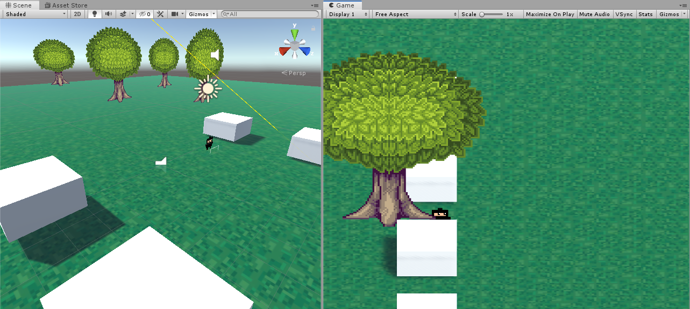
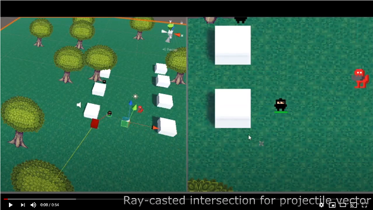

# Shuriken

Uses a ray-cast intersection from the mouse to the ground plane to shoot projectiles.
Basic follow AI with animated flipping textures based on relative position to player.

Video demonstration:

